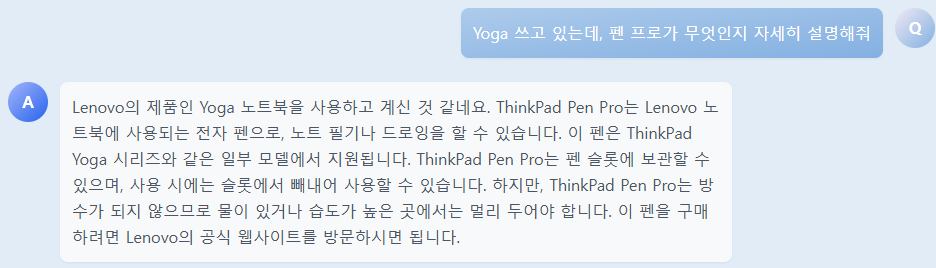
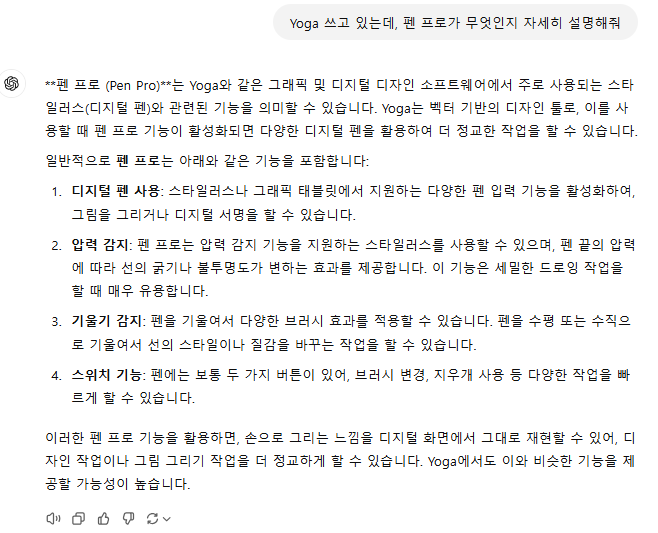
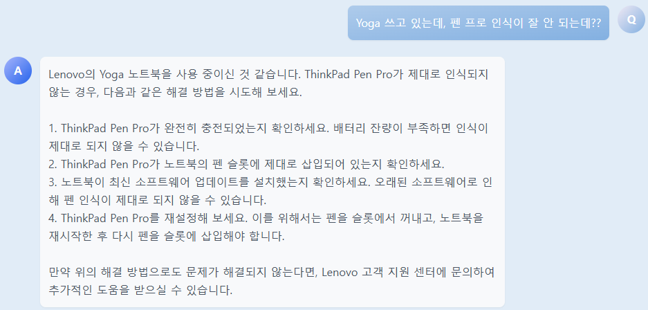
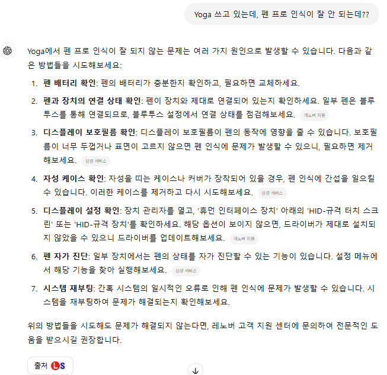

# ssafy-2024-back

# 기능

- 사용자가 노트북에 대한 사용 방법을 묻는 경우, 질문 내용에서 노트북 제조사를 식별하는 기능을 추가했습니다.
- 식별된 노트북 제조사를 기반으로, 사전 학습된 사용 설명서를 참조하여 정확한 답변을 제공합니다.

## 주요 기능

### 1. 할루시네이션 답변 방지

- **notbot의 답변**
    

- **OpenAI ChatGPT의 답변**:
  - "Yoga"는 레노바의 노트북 모델명이지만, 그래픽 디지털 디자인 소프트웨어와 혼동될 수 있습니다.
  - "Pen Pro"는 스타일러스(디지털 펜)로 혼동될 수 있습니다.
  
  

### 2. 부정확한 답변 방지

- **notbot의 답변**
    

- **OpenAI ChatGPT의 답변** → 웹 검색을 통한 답변
  
  삼성 S펜에 대한 답변도 포함하여 제공되고 있습니다.

    
